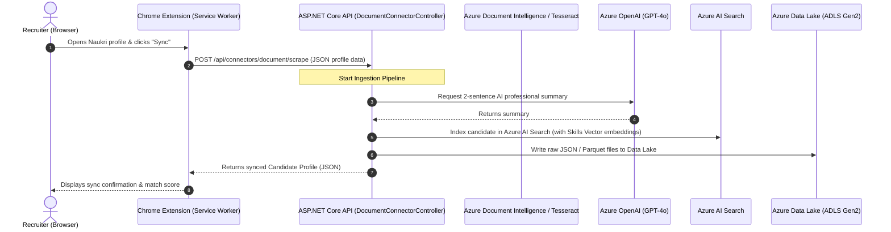

# Knowledge Transfer Guide: Resume Parsing & Extension Backend Integration

This guide provides a comprehensive overview of the components, pipelines, and integrations built for the **JoyATS / JoyPIM** platform. It is designed to help the onboarding interns understand the system's architecture, flow, and key classes.

---

## 🗺️ System Architecture & Data Flow

The system integrates a **Chrome Extension** (frontend/content scraping) with an **ASP.NET Core Web API Backend** (text extraction, AI parsing, search indexing, and ADLS storage).

---

## 🧩 1. Backend: `Joy.PIM.DocumentConnector`

The backend orchestrates document text extraction, AI-powered information extraction, and storage in the Data Lake.

### 🔑 Core Classes & Responsibilities

*   **[`DocumentConnector.cs`](file:///C:/Agentic%20AI/JoyPIM/api/Joy.PIM/Joy.PIM.DocumentConnector/DocumentConnector.cs)**
    *   **Role**: The primary orchestrator/pipeline runner.
    *   **Workflow**:
        1.  Resolves text extractors based on the file type.
        2.  Executes the primary extractor (e.g., Azure Document Intelligence).
        3.  **Fallback Mechanism**: If the primary confidence is below the configured threshold, it automatically falls back to the local `TesseractExtractor` (OCR).
        4.  Writes the raw binary file to ADLS (`raw/documents/YYYY-MM-DD/{source_id}.{ext}`).
        5.  Calls `ICvParser` (`AzureOpenAICvParser`) to parse unstructured text into structured fields.
        6.  Writes parsed profile JSON to the Data Lake.
*   **[`AzureOpenAICvParser.cs`](file:///C:/Agentic%20AI/JoyPIM/api/Joy.PIM/Joy.PIM.DocumentConnector/Services/AzureOpenAICvParser.cs)**
    *   **Role**: Converts raw text to structured candidate fields using OpenAI Chat Completions.
    *   **Prompting**: Employs a strict system prompt specifying the exact JSON schema target (including fields like `full_name`, `email_address`, `skills`, `experience`, `education`, etc.).
*   **[`BlobPollingBackgroundService.cs`](file:///C:/Agentic%20AI/JoyPIM/api/Joy.PIM/Joy.PIM.DocumentConnector/BackgroundServices/BlobPollingBackgroundService.cs)**
    *   **Role**: Continuously polls Azure Blob Storage for new CV uploads.
    *   **Lease Locking**: Acquires a 60-second lease via `BlobLifecycleManager` to ensure single-instance processing.
    *   **Deduplication**: Computes the SHA-256 hash of the file bytes. If it already exists in the audit repository, it skips processing and moves the file directly to `completed/`.
    *   **Routing**: Moves successfully parsed files to `completed/` and failed files to `error/` (generating an `_error_log.json` file beside it).

### 🖥️ Text Extractors (`Extractors/`)
1.  **[`AzureDocumentIntelligenceExtractor.cs`](file:///C:/Agentic%20AI/JoyPIM/api/Joy.PIM/Joy.PIM.DocumentConnector/Extractors/AzureDocumentIntelligenceExtractor.cs)**: Communicates with Azure Form Recognizer v4 (Document Intelligence) using `prebuilt-read` or custom layouts.
2.  **[`TesseractExtractor.cs`](file:///C:/Agentic%20AI/JoyPIM/api/Joy.PIM/Joy.PIM.DocumentConnector/Extractors/TesseractExtractor.cs)**: Uses the local Tesseract OCR engine for scanned images or low-confidence PDFs.
3.  **`DocxExtractor.cs` & `PlainTextExtractor.cs`**: Lightweight local text extractors for word documents and text files.

---

## 🌐 2. Web API Controllers

The backend exposes several key API controllers to handle candidate scraping, document intelligence, search, and job description (JD) creation.

### 📄 [`DocumentConnectorController.cs`](file:///C:/Agentic%20AI/JoyPIM/api/Joy.PIM/Joy.PIM.Api/Controllers/api/DocumentConnectorController.cs)
*   `POST /api/connectors/document`: File upload extraction endpoint.
*   `POST /api/connectors/document/scrape`: Integrates directly with the Chrome Extension. Receives scraped candidate text, calls Azure OpenAI to write a 2-sentence summary, maps to `GoldProfile`, and indexes the candidate into Azure AI Search.
*   `POST /api/connectors/document/jd/match`: Ranks candidates against a Job Description using vector embeddings.
*   `POST /api/connectors/document/jd/questions`: Generates 5 initial screening questions based on the JD.
*   `POST /api/connectors/document/jd/chat`: AI chat interface about a JD (handles question prompts and candidates answers evaluation).
*   `POST /api/connectors/document/jd/evaluate`: Compares candidate responses to the JD and provides a verdict (`Strong`/`Partially acceptable`/`Weak`), gaps, and follow-up probes.

### 💼 [`JobPostingController.cs`](file:///c:/Agentic%20AI/JoyPIM/api/Joy.PIM/Joy.PIM.Api/Controllers/api/JobPostingController.cs)
*   `POST /api/v1/jobposting/create`: Allows the **Chrome Extension** to create a new job posting directly from platforms like LinkedIn.
    *   **Mapping**: It captures `JobTitle`, `Company`, `Location`, `Description`, `JobUrl`, and `EmploymentType`.
    *   **Draft Status**: Automatically resolves and maps the job posting status to **"Draft"** in the database.
    *   **Storage**: Persists the posting using the business logic tier (`_jobPosting.AddOrUpdateJobPosting`).
    *   **Response**: Returns the generated `JobId` and `JobCode` to the extension.
*   `POST /api/JobPosting/ParseAndCreateJobPosting`: Takes raw text descriptions, parses them, and adds/updates the job posting.
*   `POST /api/JobPosting/ExportJobPostings`: Exports job postings to Excel or CSV formats.
*   `POST /api/JobPosting/SendBulkEmail`: Sends bulk emails to selected candidates/recipients.

---

## 🔌 3. Frontend: Chrome Extension Background Service

Located in `client/joy-chrome-extension/`.

*   **[`service-worker.ts`](file:///C:/Agentic%20AI/JoyPIM/client/joy-chrome-extension/src/background/service-worker.ts)**
    *   Acts as the central message router for the extension.
    *   Listen to messages from content scripts (e.g., `EXTRACT_PAGE_PROFILE` on Naukri).
    *   Coordinates authentication flows (including password logins and MSAL silent sign-ins).
    *   Sends candidate data to the backend API's `/scrape` endpoint via `syncCandidateToJoyAts`.
*   **[`api-client.ts`](file:///C:/Agentic%20AI/JoyPIM/client/joy-chrome-extension/src/background/api-client.ts)**
    *   Wraps API communication using Axios.
    *   Attaches the JWT token header (`token`).
    *   Handles candidate lookup, feedback postings (`/api/v1/feedback`), duplication checks (`/api/Applicant/FindDuplicateApplicants`), and syncing to ATS (`/api/Applicant/UpsertApplicantFromExtension`).
*   **[`profile-scrape.ts`](file:///C:/Agentic%20AI/JoyPIM/client/joy-chrome-extension/src/content/naukri/profile-scrape.ts)**
    *   Executes inside the browser tab context.
    *   Uses DOM selectors (e.g. key skills list, candidacy designation, experience blocks) to extract CV info from the web page.
    *   Auto-scrolls profiles and triggers "Show More" buttons to parse the full resume text.

---

## 🗄️ 4. Database Schema: stage and file audits

*   **[`uploadedfiledatastage.sql`](file:///C:/Agentic%20AI/JoyPIM/dbscript/uploadedfiledatastage.sql)**:
    Defines the PostgreSQL tables and triggers tracking stages and audit paths of files processed. Employs update-date triggers (`BEFORE UPDATE EXECUTE FUNCTION public.update_modified_column()`).

 